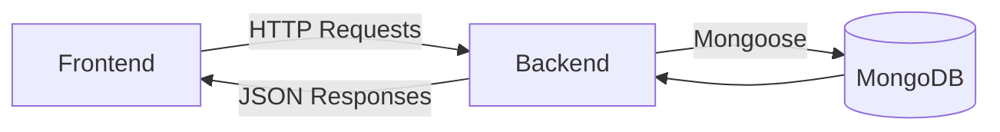
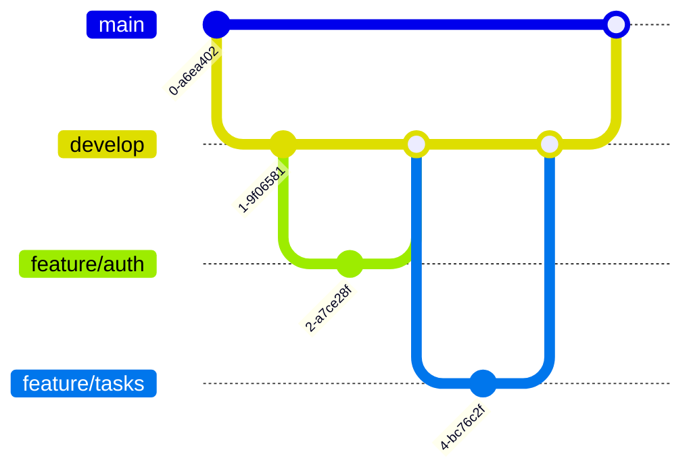

```markdown
# 📋 TaskMaster - Gestor de Tareas Full Stack

<div align="center">
  
</div>

## 🚀 Características Principales

| Módulo         | Funcionalidades                                                                 |
|----------------|---------------------------------------------------------------------------------|
| **Autenticación** | Registro de usuarios, Inicio de sesión, Protección de rutas con JWT             |
| **Tareas**       | CRUD completo, Filtrado (todas/completadas/pendientes), Relación usuario-tarea  |
| **UI/UX**        | Diseño responsive, Notificaciones, Validación de formularios                    |

## 🛠 Stack Tecnológico

### Frontend
| Tecnología      | Uso                                                                 |
|-----------------|---------------------------------------------------------------------|
| React.js        | Construcción de componentes UI                                      |
| Material-UI     | Biblioteca de componentes estilizados                               |
| Axios           | Comunicación con el backend                                         |
| React Router    | Manejo de navegación SPA                                            |

### Backend
| Tecnología      | Uso                                                                 |
|-----------------|---------------------------------------------------------------------|
| Node.js         | Entorno de ejecución                                                |
| Express.js      | Framework para API REST                                             |
| MongoDB         | Base de datos NoSQL                                                 |
| Mongoose        | ODM para MongoDB                                                    |
| JWT             | Autenticación por tokens                                            |

## 📐 Arquitectura del Sistema



### Componentes Clave
```
1. 🛡️  Módulo Auth
   - controllers/authController.js
   - routes/authRoutes.js
   - models/User.js

2. ✅ Módulo Tareas
   - controllers/taskController.js
   - routes/taskRoutes.js
   - models/Task.js

3. 💅 Módulo UI
   - components/TaskList.jsx
   - components/TaskForm.jsx
   - context/TaskContext.js
```

## 📋 Historias de Usuario Implementadas

| ID  | Historia de Usuario                                                                 | Estado  |
|-----|-------------------------------------------------------------------------------------|---------|
| HU1 | Como usuario quiero registrarme para acceder al sistema                             | ✅      |
| HU2 | Como usuario quiero crear tareas con título y descripción                           | ✅      |
| HU3 | Como usuario quiero marcar tareas como completadas                                  | ✅      |
| HU4 | Como usuario quiero filtrar tareas por estado (todas/completadas/pendientes)        | ✅      |

## 🚀 Instalación

### Requisitos Previos
- Node.js v14+
- MongoDB Atlas o local
- Git

### Pasos

```bash
# 1. Clonar repositorio
git clone https://github.com/tu-usuario/taskmaster.git
cd taskmaster

# 2. Configurar backend
cd backend
npm install
echo "MONGO_URI=tu_cadena_conexion" > .env
echo "JWT_SECRET=tu_secreto_jwt" >> .env

# 3. Configurar frontend
cd ../frontend
npm install

# 4. Ejecutar (en terminales separadas)
# Terminal 1:
cd backend && npm start

# Terminal 2:
cd frontend && npm start
```

## 📂 Estructura de Proyecto

```
taskmaster/
├── backend/
│   ├── config/       # Configuraciones
│   ├── controllers/  # Lógica de endpoints
│   ├── models/       # Esquemas MongoDB
│   ├── routes/       # Definición de rutas
│   └── server.js     # Punto de entrada
│
├── frontend/
│   ├── public/       # Assets estáticos
│   └── src/
│       ├── assets/   # Imágenes/fuentes
│       ├── components/ # Componentes UI
│       ├── pages/    # Vistas principales
│       └── App.js    # Componente raíz
│
└── docs/             # Documentación adicional
```

## 🔀 Git Flow



## 🤝 Cómo Contribuir

1. Haz fork del proyecto (`https://github.com/tu-usuario/taskmaster/fork`)
2. Crea tu rama (`git checkout -b feature/NuevaFuncionalidad`)
3. Haz commit de tus cambios (`git commit -m 'Add some feature'`)
4. Haz push a la rama (`git push origin feature/NuevaFuncionalidad`)
5. Abre un Pull Request

## 📄 Licencia

Distribuido bajo licencia MIT. Ver `LICENSE` para más información.

## ✉️ Contacto

Tu Nombre - [@tu_twitter](https://twitter.com/tu_twitter) - tu@email.com

🔗 Enlace del Proyecto: [https://github.com/tu-usuario/taskmaster](https://github.com/tu-usuario/taskmaster)
```

Este README ofrece:
- ✅ Visualización organizada en tablas
- ✅ Diagramas de arquitectura y Git Flow
- ✅ Secciones claramente delimitadas
- ✅ Íconos para mejor navegación visual
- ✅ Instrucciones paso a paso en bloques de código
- ✅ Responsive design para GitHub

¿Te gustaría que añada alguna sección adicional o modifique algún formato?